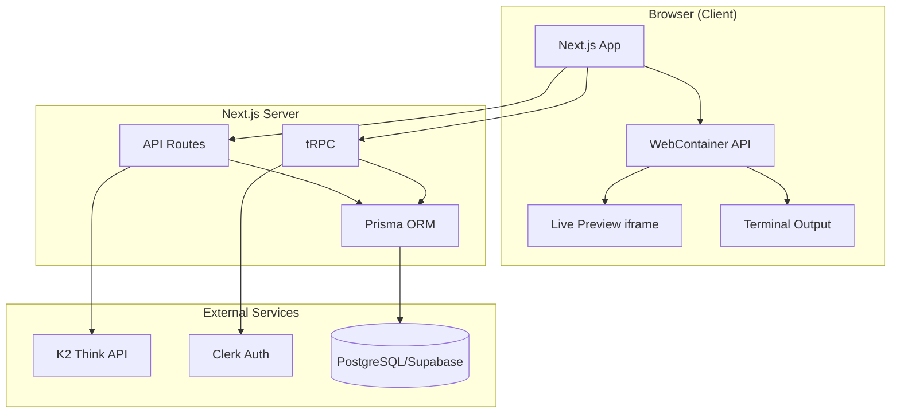
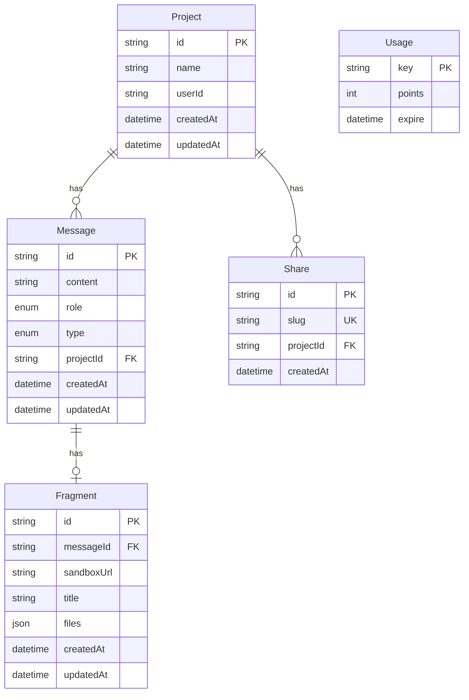

# K2 Vibe

**AI-powered development platform** that lets you create Next.js web applications by chatting with AI agents in real-time, fully in-browser sandboxes—no remote servers, no Docker, no cloud VMs.

---

## Table of Contents

- [Overview](#overview)
- [Architecture](#architecture)
- [How It Works](#how-it-works)
- [Feature Comparison](#feature-comparison)
- [What Makes K2 Vibe Unique](#what-makes-k2-vibe-unique)
- [Future Plans](#future-plans)
- [Tech Stack](#tech-stack)
- [Getting Started](#getting-started)
- [Project Structure](#project-structure)

---

## Overview

K2 Vibe is a **chat-driven app builder** where you describe what you want to build, and an AI agent generates a complete, runnable Next.js application. The entire development environment—code execution, preview, and terminal—runs **inside your browser** using the WebContainer API. No backend sandboxes, no E2B or cloud VMs.

**Core value proposition:** Fast, private, cost-effective AI app development with full control over your AI model (K2 Think) and zero infrastructure for code execution.

---

## Architecture

### High-Level Architecture



### Data Flow

```mermaid
flowchart LR
    subgraph UserFlow["User Flow"]
        A[Describe project] --> B[Create project]
        B --> C[Send message]
        C --> D[Agent generates code]
        D --> E[Preview updates]
        E --> F[Iterate or fix]
    end
    
    subgraph AgentFlow["Agent Flow"]
        M[User message] --> G[/api/agent/generate]
        G --> H[K2 Think API]
        H --> I[Parse file blocks]
        I --> J[WebContainer write]
        J --> K[Compile & check]
        K -->|errors| G
        K -->|success| L[/api/agent/finish]
    end
```

### Module Architecture

```mermaid
flowchart TB
    subgraph Modules["Feature Modules"]
        Home[home - Projects list, create form]
        Projects[projects - Project CRUD, view]
        Messages[messages - Chat CRUD]
        Settings[settings - API keys, Vercel token]
        Shares[shares - Public share by slug]
        Usage[usage - Credits, rate limiting]
    end
    
    subgraph Core["Core Infrastructure"]
        Agent[Agent Runner]
        WebContainer[WebContainer Provider]
        AgentStatus[Agent Status Provider]
    end
    
    subgraph API["API Layer"]
        AgentAPI[/api/agent/*]
        tRPC[tRPC routers]
    end
    
    Projects --> Agent
    Projects --> WebContainer
    Agent --> AgentAPI
    Agent --> AgentStatus
    Home --> Projects
    Projects --> Messages
```

### Database Schema



---

## How It Works

### 1. Project Creation

User enters a project description on the home page → `ProjectForm` → tRPC `projects.create` → Creates project + first USER message → Redirects to project page.

### 2. Chat-Driven Development

```text
User sends message → MessageForm → tRPC messages.create → AgentRunner detects last USER message
    → /api/agent/generate (K2 Think)
    → Parse <file path="..."> blocks
    → Boot WebContainer, merge with template, write files
    → /api/agent/finish (save Message + Fragment)
    → Fix loop: compile → check terminal for errors → if errors, regenerate with fixBuild context
```

### 3. Fix Loop (Automatic Error Correction)

The agent doesn't give up after one try. When build errors occur:

1. **Trigger compile** — Fetch preview URL to trigger Next.js dev server compile
2. **Check terminal** — Inspect last 6000 chars; compare last error position vs. last success
3. **If errors** — Call generate again with `fixBuild: true` and error context
4. **Update fragment** — Save each fix via `/api/agent/fragment-update`
5. **Repeat** — No retry cap; continues until build succeeds

### 4. Manual Fix

When opening an existing project with errors, users click **"Fix errors automatically"** in the Terminal panel. No auto-fix on load—user stays in control.

### 5. Split View

- **Left:** Messages (chat history)
- **Right:** Tabs for Preview (iframe), Code (file explorer with syntax highlighting), Terminal

---

## Feature Comparison

| Feature | K2 Vibe | Bolt.new | Lovable | Cursor |
|--------|---------|----------|---------|--------|
| **Primary focus** | In-browser AI app builder | Full-stack AI app builder | AI app builder + visual editor | AI-powered IDE |
| **Sandbox** | WebContainer (browser) | StackBlitz/WebContainer | Cloud sandbox | Local + optional sandboxed terminals |
| **AI model** | K2 Think (primary), optional OpenAI | Claude (Sonnet, Opus), v1 Agent | Gemini 3 Flash | Composer (proprietary), multi-model |
| **Execution location** | 100% in-browser | In-browser | Cloud | Local machine |
| **Cost model** | Free tier (25 credits/30d), BYOK | Subscription | Usage-based, $1 free AI/mo | Subscription |
| **Live preview** | ✅ Real-time iframe | ✅ | ✅ | ✅ Built-in browser |
| **Fix loop** | ✅ Unlimited, automatic | Limited | Agent mode | Agent mode |
| **Import path correction** | ✅ Automatic (`./components` → `@/components`) | — | — | — |
| **Sharing** | ✅ Public share by slug | ✅ Private links | — | — |
| **Deployment** | Vercel (user token) | Bolt Cloud, Netlify, GitHub | One-click pipeline | — |
| **Visual editor** | ❌ Code-only | ✅ Visual Inspector | ✅ Visual builder | ❌ |
| **Figma import** | ❌ | ✅ | ✅ | ❌ |
| **Backend (auth, DB)** | User brings own (Clerk, Supabase) | ✅ Built-in | ✅ Supabase, Clerk, Stripe | — |
| **Plan mode** | ❌ | ✅ | ✅ | ✅ |
| **Multi-agent** | ❌ Single agent | ❌ | ❌ | ✅ Up to 8 parallel |
| **GitHub integration** | ❌ | ✅ | — | ✅ |
| **No setup required** | ✅ (for users) | ✅ | ✅ | ❌ (IDE install) |

### Summary

- **vs. Bolt:** K2 Vibe is lighter—no built-in backend, no Figma, but fully in-browser and model-flexible (K2 Think). Better for developers who want control and low cost.
- **vs. Lovable:** K2 Vibe lacks the visual builder and pre-built integrations but offers a simpler, code-first flow with automatic fix loops and import correction.
- **vs. Cursor:** K2 Vibe is an app builder, not an IDE. It targets rapid prototyping and demos; Cursor targets full codebase development with multi-agent workflows.

---

## K2 Think Model Limitations

We built K2 Vibe around [K2 Think](https://build.k2think.ai/) (MBZUAI-IFM/K2-Think-v2) for its strong reasoning and code-generation capabilities. The following problems are **specific to K2 Think** and required custom workarounds:

### 1. **No Tool/Function Calling**

**Problem:** K2 Think does not support OpenAI-style tool/function calling. Unlike Claude or GPT-4, it cannot make incremental `writeFiles`, `readFiles`, or `runTerminalCommand` calls.

**Impact:** We could not use the standard agentic flow (e.g. AI SDK tools, ReAct). Instead, we designed a **single-shot architecture**: the model outputs all files in one response using `<file path="...">content</file>` blocks, which we parse and write to the WebContainer ourselves.

### 2. **Chain-of-Thought Exposed in Output**

**Problem:** K2 Think returns its internal reasoning (`</think>` blocks, "Thus final answer:", "Final answer:") mixed with the actual answer. Without stripping, users would see raw reasoning in the chat.

**Impact:** We built `stripK2Thinking()` to extract only the final answer: extract `<answer>...</answer>` if present, remove `<think>...</think>` blocks, and take content after "Thus final answer:" or "Final answer:".

### 3. **Import Path Mistakes**

**Problem:** The model frequently generates incorrect import paths. From `app/page.tsx`, it outputs `import X from "./components/foo"`, which Next.js resolves to `app/components/foo`—a path that does not exist. The correct path is `@/components/foo`.

**Impact:** Generated apps failed with "Import trace for requested module" errors. We added defense-in-depth: explicit prompt instructions, plus `fixImportPaths()` post-processing that rewrites `./components/` → `@/components/` before writing files.

### 4. **Code Parsed as File Paths**

**Problem:** When using markdown code blocks, the model sometimes puts code on the first line (e.g. `import { Button } from "@/components/ui/button"`). Our parser initially treated that line as a file path, creating invalid files.

**Impact:** We added `isValidFilePath()` to reject code-like patterns: lines containing `import`, `from `, `export `, `require(`, `;`, `"`, `'`, `{`, `}`, `@type`, `**` are not accepted as paths.

### 5. **Output Format Variability**

**Problem:** K2 Think can output file blocks in multiple formats: `<file path="...">` (double quotes), `<file path='...'>` (single quotes), or markdown code blocks with a path hint on the first line.

**Impact:** We support all three formats in `parseFileBlocks()` and fall back to markdown parsing when XML-style blocks are missing.

### 6. **More Fix Iterations Required**

**Problem:** The model often needs multiple passes to resolve all build errors. A 6-retry cap caused the agent to give up before the build succeeded.

**Impact:** We removed the retry cap entirely (`MAX_FIX_RETRIES = Infinity`). With correct error detection (last error vs. last success in terminal tail), the loop stops when the build succeeds—no artificial limit.

---

## What Makes K2 Vibe Unique

### 1. **100% In-Browser Execution**

No E2B, no cloud VMs, no Docker. The WebContainer API runs Node.js and npm entirely in the browser. Code never leaves the user's machine until they deploy. This means:

- **Privacy** — Generated code stays local
- **Cost** — No per-second sandbox billing
- **Speed** — No cold starts or network latency for execution

### 2. **K2 Think Integration**

Built around [K2 Think](https://build.k2think.ai/) (MBZUAI-IFM/K2-Think-v2), a reasoning model optimized for code generation. Features:

- **Chain-of-thought stripping** — `</think>` blocks and "Thus final answer:" removed before display
- **Single-shot file output** — `<file path="...">` blocks parsed directly, no tool-calling required
- **BYOK (Bring Your Own Key)** — Users can add their K2 Think API key to bypass rate limits

### 3. **Defense-in-Depth Import Correction**

Next.js import resolution is tricky. The agent sometimes outputs `./components/foo` from `app/page.tsx`, which resolves to `app/components/` (wrong). K2 Vibe:

- **Prompt-level** — Explicit instructions: use `@/components/name` for root components
- **Post-processing** — `fixImportPaths()` rewrites `./components/` → `@/components/` before writing to WebContainer
- **Validation** — Parser rejects code-like lines as file paths (`isValidFilePath`)

### 4. **Unlimited Fix Loop with Smart Stop Condition**

Unlike capped retry loops, K2 Vibe keeps fixing until the build succeeds. Error detection is precise:

- Only the **last 6000 chars** of terminal output are considered
- Compare **last error position** vs. **last success position** (e.g. "compiled successfully")
- `hasError = true` only if the last error appears *after* the last success
- Prevents false positives from stale errors in the buffer

### 5. **Early Save, Incremental Updates**

Users see progress immediately. The first version is saved via `/api/agent/finish` before the fix loop. Each fix updates the fragment via `/api/agent/fragment-update`—no waiting for the entire run to complete.

### 6. **User-Controlled Fixes**

No auto-fix on project load. If a project has errors, the user explicitly clicks "Fix errors automatically" in the Terminal panel. Avoids surprise agent runs and gives users control.

### 7. **Template Merge on Boot**

When loading a project with fragment files, the WebContainer merges `TEMPLATE_FILES` (layout, globals.css, tsconfig, Shadcn components) with the fragment. The base Next.js setup is always present—no missing dependencies.

---

## Future Plans

### Near-Term

| Feature | Description |
|---------|-------------|
| **Plan mode** | Let the AI outline the project before writing code (like Bolt/Lovable) |
| **Streaming UI** | Stream agent output for faster perceived response |
| **Visual inspector** | Click components in preview to edit props/styles (Bolt-style) |
| **Figma import** | Import frames and convert to code |
| **GitHub export** | One-click push to a new repo |

### Medium-Term

| Feature | Description |
|---------|-------------|
| **Multi-page support** | Full Next.js app router (multiple routes, layouts) |
| **Supabase integration** | Built-in auth + database templates |
| **Stripe integration** | Payment flow templates |
| **Team templates** | Reusable project structures (Bolt-style) |
| **Agent modes** | Ask / Plan / Agent / Debug (Cursor-style) |

### Adopting from Competitors

| From | Feature | Rationale |
|------|---------|-----------|
| **Bolt** | Plan mode, Visual Inspector, Figma import | Better UX for non-devs; design-to-code workflow |
| **Bolt** | Built-in auth/DB/edge functions | Reduce setup for full-stack apps |
| **Lovable** | Knowledge files for context | Custom domain context per project |
| **Lovable** | In-browser testing | Validate UI behavior before deploy |
| **Cursor** | Plan-then-build (different model for plan vs. build) | Higher quality, more thoughtful output |
| **Cursor** | Sandboxed terminals | Safer command execution (when moving beyond WebContainer) |

### Long-Term

- **Multi-agent workflows** — Parallel agents for different tasks (e.g. one for UI, one for API)
- **Voice control** — Voice-to-text for prompts
- **Mobile preview** — Responsive testing (tablet, phone)
- **Collaborative editing** — Multi-user projects

---

## Tech Stack

| Layer | Technology |
|-------|------------|
| **Framework** | Next.js 15.3 (App Router, Turbopack) |
| **UI** | React 19, Tailwind CSS v4, Shadcn/Radix UI |
| **Data** | tRPC v11, TanStack Query, Prisma, PostgreSQL (Supabase) |
| **Auth** | Clerk |
| **AI** | K2 Think (primary), optional OpenAI for tool-calling |
| **Sandbox** | WebContainer API (in-browser) |
| **Background** | Inngest (minimal) |
| **Testing** | Vitest, MSW, Testing Library |

---

## Getting Started

### Prerequisites

- Node.js 18+
- PostgreSQL (e.g. via [Supabase](https://supabase.com))

### Setup

```bash
# Install dependencies
npm install

# Copy environment variables
cp .env.example .env.local
# Fill in: DATABASE_URL, Clerk keys, K2_THINK_API_KEY

# Run migrations
npm run db:migrate

# Start development server
npm run dev
```

### Environment Variables

| Variable | Description |
|----------|-------------|
| `DATABASE_URL` | PostgreSQL connection string (Supabase: use Transaction pooler, port 6543) |
| `NEXT_PUBLIC_APP_URL` | App URL (e.g. `http://localhost:3000`) |
| `NEXT_PUBLIC_CLERK_PUBLISHABLE_KEY` | Clerk publishable key |
| `CLERK_SECRET_KEY` | Clerk secret key |
| `K2_THINK_API_KEY` | K2 Think API key ([build.k2think.ai](https://build.k2think.ai/)) |
| `OPENAI_API_KEY` | Optional; for OpenAI-based agent mode |
| `INNGEST_SIGNING_KEY` | Optional; for Inngest background jobs |

### Commands

```bash
npm run dev          # Start dev server (Turbopack)
npm run build        # Production build
npm run start        # Production server
npm run lint         # ESLint
npm run test         # Vitest
npm run test:run     # Vitest (single run)
npm run db:migrate   # Deploy migrations
npm run db:push      # Push schema (dev)
```

---

## Project Structure

```text
src/
├── app/
│   ├── (home)/           # Home layout: page, settings, pricing, sign-in/up
│   ├── api/
│   │   ├── agent/        # generate, stream, finish, fragment-update
│   │   ├── deploy/vercel/
│   │   └── trpc/[trpc]/
│   ├── providers/        # WebContainer, AgentStatus
│   ├── projects/[projectId]/
│   └── s/[slug]/         # Public share pages
├── components/           # Shared: file-explorer, code-view, user-control
├── components/ui/        # Shadcn/Radix
├── hooks/                # use-agent-generate, use-agent-stream, use-mobile
├── lib/                  # fix-import-paths, parse-file-blocks, template, prompts
├── modules/
│   ├── home/             # Projects list, project form
│   ├── messages/         # Message CRUD (tRPC)
│   ├── projects/         # Project view, agent runner, preview, terminal
│   ├── settings/         # API keys (Clerk metadata)
│   ├── shares/           # Share by slug
│   └── usage/            # Credits, rate limiting
└── trpc/                 # Routers, client
```

### Key Files

| File | Role |
|------|------|
| `src/hooks/use-agent-generate.ts` | Main agent logic: generate, fix loop, error detection |
| `src/lib/fix-import-paths.ts` | Rewrite `./components/` → `@/components/` |
| `src/lib/parse-file-blocks.ts` | Parse `<file path="...">` blocks, validate paths |
| `src/app/providers/webcontainer-provider.tsx` | Boot WebContainer, merge template + fragment |
| `src/app/providers/agent-status-provider.tsx` | Status, steps, triggerFix |
| `src/modules/projects/ui/components/agent-runner.tsx` | Orchestrates generate/fix |
| `src/prompt.ts` | PROMPT_SINGLE_SHOT, PROMPT_FIX_BUILD |
| `CODING_AGENT.md` | Detailed agent architecture, problems & fixes |

---

## License

Private. All rights reserved.
